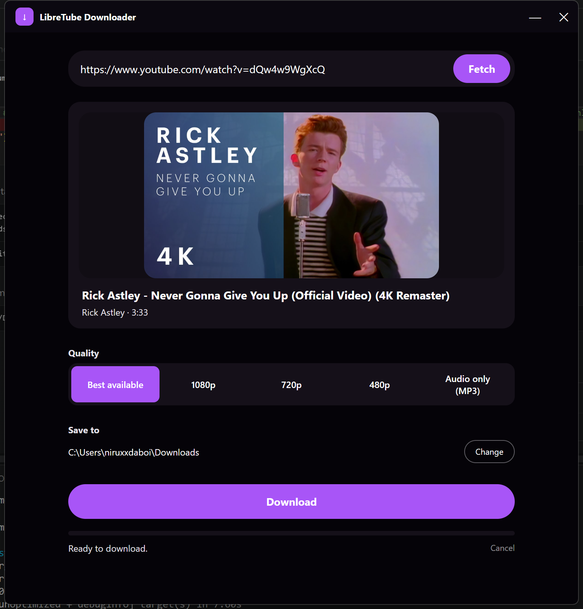
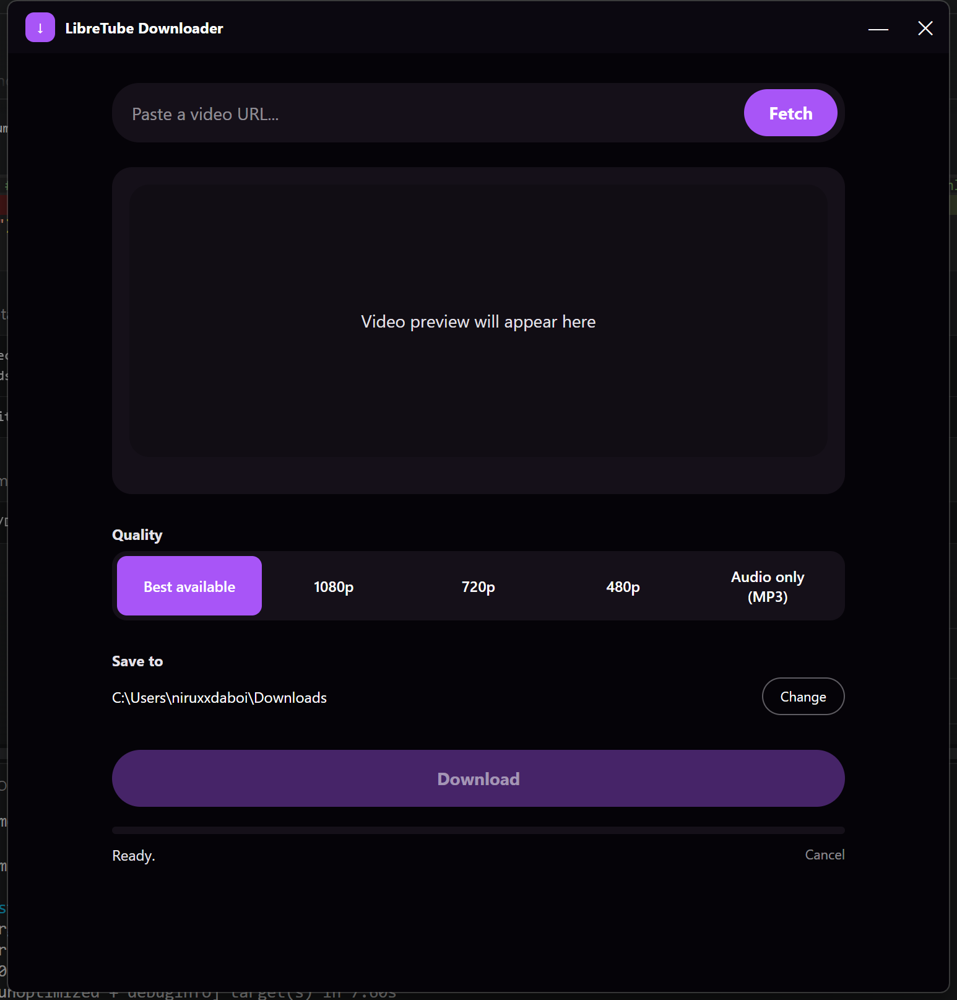
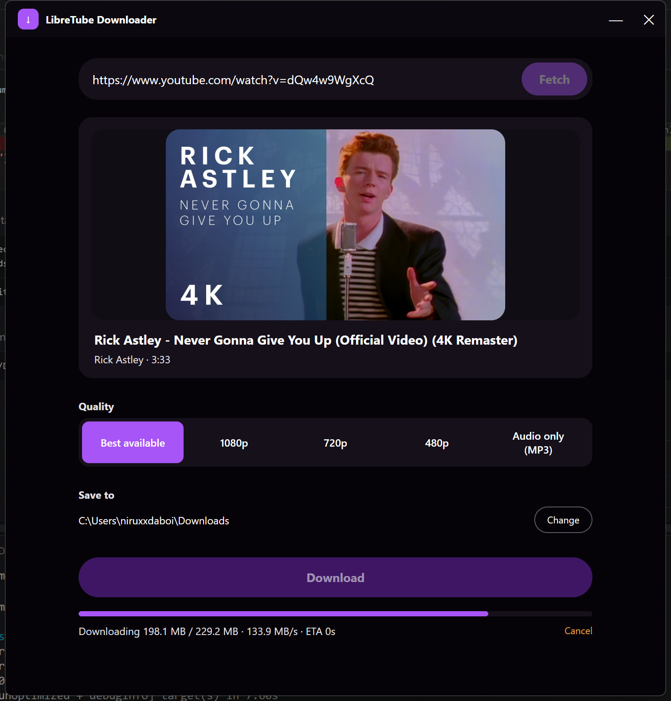
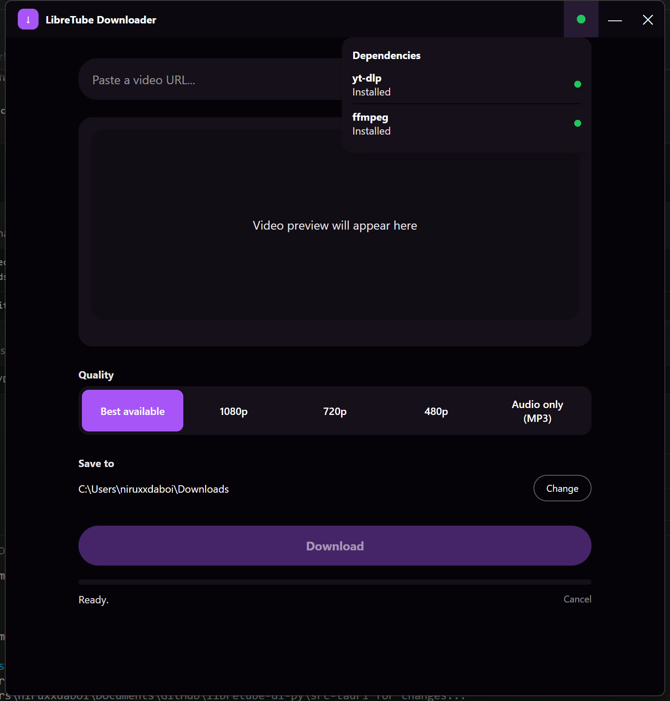

<div align="center">

# LibreTube Downloader

A clean, modern desktop video downloader. Paste a URL, preview the video, pick a quality, and download.

Built with [Tauri](https://tauri.app/), TypeScript, and Tailwind CSS v2 — powered by [yt-dlp](https://github.com/yt-dlp/yt-dlp), so it works with YouTube and hundreds of other sites.




</div>

## Screenshots

<table>
<tr>
<td align="center" width="33%">
<br>
<sub>Paste a URL to get started</sub>
</td>
<td align="center" width="33%">
<br>
<sub>Preview, pick a quality, choose a folder</sub>
</td>
<td align="center" width="33%">
<br>
<sub>Live progress with speed and ETA</sub>
</td>
</tr>
</table>

## Features

- Paste a URL and fetch title, uploader, duration, and thumbnail before downloading
- Quality presets: Best available, 1080p, 720p, 480p, or Audio only (MP3)
- Custom download folder picker
- Live progress with speed and ETA, and a cancel button mid-download
- Frameless window with a custom titlebar and a smooth fade in on launch / fade out on close
- Cross-platform: Windows, macOS, Linux
- yt-dlp and ffmpeg ship bundled in the installer — nothing to install separately
- A live dependency-status dot in the titlebar (green/yellow/red) with one-click install if something's missing — see [Dependency status & auto-install](#dependency-status--auto-install)

## How to install (Linux)

Tagged releases are built automatically by [`.github/workflows/release.yml`](.github/workflows/release.yml) and published as `.deb`, `.rpm`, and `.AppImage` files on the [Releases page](https://github.com/niruxx/libretube-dl/releases). Filenames follow Tauri's default pattern (`LibreTube Downloader_<version>_amd64.<ext>`) and contain a space, so quote them or tab-complete rather than typing them out.

### Debian / Ubuntu (.deb)

```bash
sudo dpkg -i "LibreTube Downloader_0.1.0_amd64.deb"
sudo apt-get install -f   # pulls in any missing dependencies
```

### Fedora (.rpm)

```bash
sudo dnf install "./LibreTube Downloader-0.1.0-1.x86_64.rpm"
```

### Arch Linux (PKGBUILD)

A `PKGBUILD` is provided in [`packaging/arch/`](packaging/arch/PKGBUILD). It builds the app from source and packages the resulting binary, icons, and a `.desktop` entry:

```bash
git clone https://github.com/niruxx/libretube-dl.git
cd libretube-dl/packaging/arch
makepkg -si
```

This installs a `libretube-downloader` binary plus a desktop entry, launchable from your app menu as "LibreTube Downloader".

### AppImage (any distro)

No installation needed — download, make it executable, and run:

```bash
chmod +x "LibreTube Downloader_0.1.0_amd64.AppImage"
./"LibreTube Downloader_0.1.0_amd64.AppImage"
```

For menu/icon integration, open it once with [AppImageLauncher](https://github.com/TheAssassin/AppImageLauncher) (if installed) or move it into `~/Applications`.

### Building these yourself

All three formats can also be produced locally on a Linux machine with the [Requirements](#requirements) below installed — see [Building](#building). All three were built and smoke-tested (including launching the AppImage) on Fedora 44 as part of setting this up; see the `NO_STRIP` note there if you hit an AppImage bundling error on a similarly recent distro.

## Tech stack

| Layer | Technology | Role |
|---|---|---|
| Desktop shell | [Tauri 2](https://tauri.app/) | Rust-based native shell that renders the UI in the OS's built-in webview (WebView2/WKWebView/WebKitGTK) instead of bundling Chromium — the app stays around ~15MB before the bundled yt-dlp/ffmpeg, versus Electron-style alternatives |
| Frontend logic | [TypeScript](https://www.typescriptlang.org/) | `src/main.ts` — no framework; direct DOM updates, Tauri IPC calls, and the fetch/download flow |
| Styling | [Tailwind CSS v2](https://v2.tailwindcss.com/) | Utility-first CSS (see [Notes on the Tailwind v2 setup](#notes-on-the-tailwind-v2-setup) for why v2 specifically, and what that required) |
| Bundler / dev server | [Vite](https://vitejs.dev/) | Builds `src/` to `dist/`, which Tauri embeds into the app |
| Backend | [Rust](https://www.rust-lang.org/) (`src-tauri/`) | Process management for yt-dlp/ffmpeg, progress-event parsing, file dialogs, window control — see [Architecture](#architecture) |
| Downloading | [yt-dlp](https://github.com/yt-dlp/yt-dlp) + [ffmpeg](https://ffmpeg.org/) | Do the actual fetching, downloading, and format conversion; bundled into the installer (see [Bundled dependencies](#bundled-dependencies)) |

## Requirements

- **Node.js 18+** and **Rust** (stable toolchain) to build
- **yt-dlp** and **ffmpeg** — see [Bundled dependencies](#bundled-dependencies) below. The built installer ships with both, so end users don't need to install anything separately; if either is ever missing, the app can [install it on demand](#dependency-status--auto-install).

## Run

```bash
npm install
npm start
```

`npm start` launches the full desktop app (equivalent to `npm run tauri dev`).

## Building

```bash
./scripts/fetch-binaries.ps1   # Windows — once, to pull the sidecar binaries (see below)
./scripts/fetch-binaries.sh    # Linux/macOS — same thing
npm run tauri build
```

Produces platform installers (MSI/NSIS on Windows, DMG on macOS, deb/rpm/AppImage on Linux) in `src-tauri/target/release/bundle/`. On Linux, `tauri build` produces `.deb`, `.rpm`, and `.AppImage` from a single build — no need to build separately on Debian, Fedora, etc. See [How to install](#how-to-install-linux) for pre-built releases, or [`packaging/arch/PKGBUILD`](packaging/arch/PKGBUILD) for an Arch package that runs this build itself.

On distros with a very recent glibc/binutils (RELR relocations, e.g. Fedora 44+), the AppImage step's bundled `strip` tool can't parse the `.relr.dyn` section and aborts bundling with `unknown type [0x13] section '.relr.dyn'`. Set `NO_STRIP=1` to skip that (optional) stripping step and avoid the failure:

```bash
NO_STRIP=1 npm run tauri build
```

## Bundled dependencies

yt-dlp and ffmpeg are bundled straight into the app via Tauri's [sidecar mechanism](https://tauri.app/develop/sidecar/) (`bundle.externalBin` in `tauri.conf.json`) rather than requiring a separate install — the installer includes both, and the app works out of the box.

- `scripts/fetch-binaries.ps1` (Windows) / `scripts/fetch-binaries.sh` (Linux/macOS) download the official yt-dlp release binary into `src-tauri/binaries/` (gitignored — each machine fetches its own copy rather than committing ~250MB of binaries to source control) and fetch a static ffmpeg build alongside it.
- Binaries must be named `<name>-<target-triple>[.exe]`, e.g. `yt-dlp-x86_64-pc-windows-msvc.exe`; run `rustc -vV` to find your triple for other platforms. Tauri strips the triple and copies the binary next to the installed app at build time.
- At runtime, `find_binary()` in `src-tauri/src/downloader.rs` looks for `yt-dlp`/`ffmpeg` next to the running executable first (where the bundled sidecars land), then falls back to `PATH`. If a binary is still missing — a corrupted install, or a platform that hasn't had its binaries added to `src-tauri/binaries/` yet — the status dot below turns red/yellow and offers a one-click install instead of failing silently.

## Dependency status & auto-install



A status dot in the titlebar (left of minimize/close) reflects whether yt-dlp and ffmpeg were actually found at startup:

- **Green** — both found, everything works
- **Yellow** — one found, one missing (fetching/downloading still works, but quality merges or MP3 conversion may not, depending on which is missing)
- **Red** — neither found; fetching and downloading are disabled until yt-dlp is installed

Clicking the dot opens a panel listing each dependency's status. For anything missing, an **Install** button downloads and installs it directly — no browser, no manual file placement:

- **yt-dlp**: downloads the platform's official standalone binary directly (`yt-dlp.exe` / `yt-dlp_macos` / `yt-dlp_linux` from the [yt-dlp releases](https://github.com/yt-dlp/yt-dlp/releases)).
- **ffmpeg**: downloads a static build and extracts just the `ffmpeg` binary — a zip from [BtbN/FFmpeg-Builds](https://github.com/BtbN/FFmpeg-Builds) on Windows/Linux (Linux via `tar -xJf`, since that's a standard system utility rather than another dependency), or from [evermeet.cx](https://evermeet.cx/ffmpeg/) on macOS.

Both install into the same directory `find_binary()` already checks first (next to the running executable), and progress streams back to the panel live via an `install-progress` event, the same pattern the download progress bar uses. This logic lives in `src-tauri/src/installer.rs`, separate from the download logic in `downloader.rs`.

This is a fallback path, not the primary flow — real end users get green immediately because the binaries are bundled (see [Bundled dependencies](#bundled-dependencies) above). It matters most for platforms without bundled binaries yet, or a corrupted install.

## Architecture

```
src/                        frontend (TypeScript, no framework)
  main.ts                   UI logic: fetch/download flow, event listeners, fade in/out
  styles.css                Tailwind directives + custom scrollbar/drag-region CSS
index.html                  markup: titlebar, URL bar, preview card, quality picker, progress

src-tauri/
  src/
    lib.rs                  Tauri app setup, command registration
    downloader.rs           yt-dlp/ffmpeg discovery, fetch_info, start_download,
                             cancel_download (process-group kill), pick_folder, reveal_in_folder,
                             quit_app
    installer.rs            install_dependency: downloads + installs yt-dlp/ffmpeg on demand
  tauri.conf.json            frameless window, size, centered on launch
  capabilities/default.json  permission grants (dialog, opener, window controls)
  binaries/                 sidecar binaries for bundling (gitignored, see fetch-binaries.ps1/.sh)

packaging/arch/PKGBUILD    Arch Linux package definition (builds from source, see makepkg above)
.github/workflows/         CI: builds and publishes deb/rpm/AppImage on tagged releases
```

**How progress reporting works:** the Rust backend spawns `yt-dlp` with a custom `--progress-template` that prints a machine-parseable line per progress tick (`LTDL_PROGRESS|downloaded|total|...`) and a `--print after_move:...` line with the final file path once postprocessing finishes. A background thread reads `yt-dlp`'s stdout line-by-line, parses these, and emits them as Tauri events (`download-progress`, `download-status`) that the frontend listens for. Cancellation kills the whole process group (via the [`command-group`](https://docs.rs/command-group) crate), not just the immediate `yt-dlp` process, so a spawned `ffmpeg` merge/convert step is also stopped.

**Why closing calls a Rust command instead of `window.close()`:** on Windows, a frameless window (`decorations: false`) calling the JS `Window.close()` API was found to leave the process stuck — the window visually clears and stops responding, but never actually exits. `fadeOutAndClose()` in `main.ts` instead invokes the `quit_app` command, which kills any in-progress download's process group and calls `AppHandle::exit()` directly from Rust, which reliably terminates the app.

## Notes on the Tailwind v2 setup

This project intentionally pins **Tailwind CSS v2**, which predates the always-on JIT engine and arbitrary-value bracket syntax (`h-[42px]`) that shipped in v3. Exact pixel values the design needs (titlebar height, border radii, etc.) are instead declared as named entries in `tailwind.config.cjs`'s `theme.extend`. Color-opacity utilities similarly use v2's two-class form (`bg-accent bg-opacity-40`) rather than v3's slash syntax (`bg-accent/40`), and the `disabled:` variant — default in v3+ — is explicitly enabled per-utility under `variants.extend`, since v2 requires opting in.
